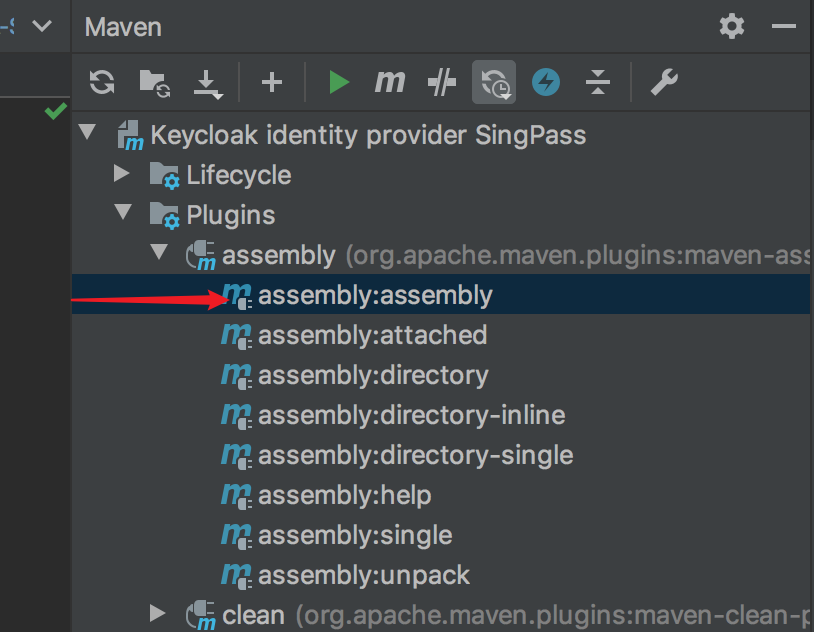
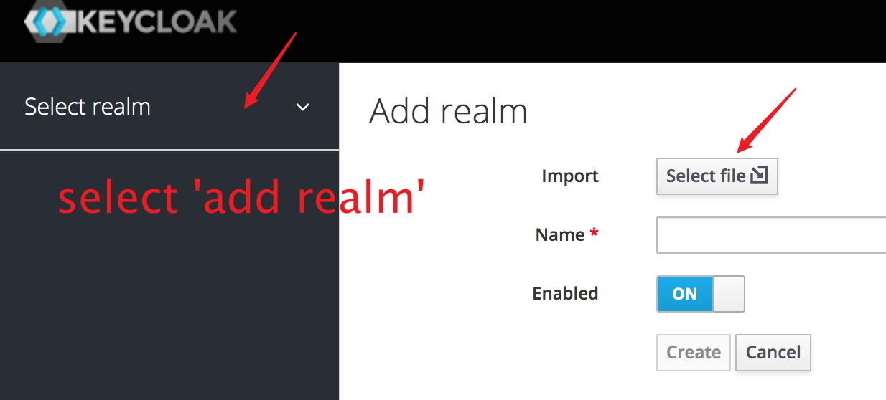
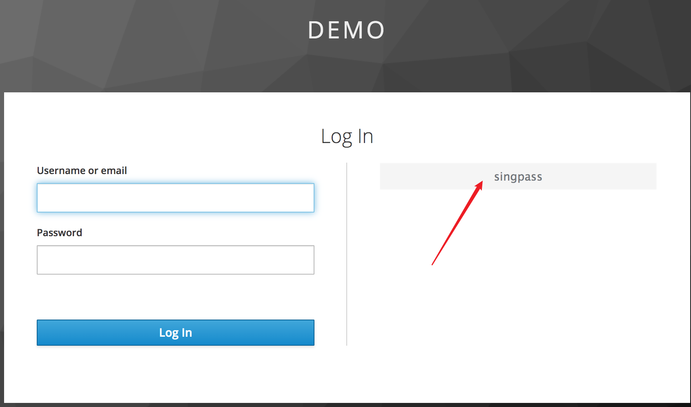

# How to Start SEA-SC-Integration-Demo-Locally

- [Run keycloak](#Run-keycloak)
- [Import json config into keycloak](#import-json-config-into-keycloak)
- [Setup Mockpass](#Set-up-Mockpass)
- [Run SEA-SC-Integration-Demo](#run-sea-sc-integration-demo)

## Run keycloak
### Install Keycloak
there are two ways to install and start keycloak:
 - [By package](https://www.keycloak.org/docs/latest/getting_started/index.html)
 - [By Docker](https://hub.docker.com/r/jboss/keycloak/)
 
### Install Keycloak-idp-singpass plugin for Keycloak
- build keycloak plugin jar package
    
- copy `target/keycloak-idp-singpass-1.0.2-jar-with-dependencies.jar` to `$KEYCLOAK_HOME/standalone/deployments/`

## Import json config into keycloak
1. download json file - [static/keycloak-realm-configuration.json](/static/keycloak-realm-configuration.json)
1. import realm setting


## Set up Mockpass
1. download [mockpass](https://github.com/ThoughtWorksInc/SEA-SC-OpenID/tree/mockpass)
1. start mockpass service in local:
   ```
   npm install
   export SHOW_LOGIN_PAGE=true
   npm start
   ```
1. If want to know more detail about how to sign and encrypt - refer to mockpass readme and [lib/express/oidc.js](https://github.com/ThoughtWorksInc/SEA-SC-OpenID/tree/mockpass/)

## Run SEA-SC-Integration-Demo

1. download [SEA-SC-Integration-Demo](https://github.com/ThoughtWorksInc/SEA-SC-Integration-Demo);
   this project achieves `login with roles` and `logout`

1. SEA-SC-Integration-Demo provides 5 APIs, you can check in project -> KeycloakController.kt
    1. `http://localhost:8080/sso/keycloak/user`: allow `app-user` role login
    2. `http://localhost:8080/sso/keycloak/admin`: allow `app-admin` role login
    3. `http://localhost:8080/sso/keycloak/all-user`: allow `app-admin` and `app-user` role login
    4. `http://localhost:8080/sso/keycloak/logout`: user logout

1. start `SEA-SC-Integration-Demo`
    1. visit `http://localhost:8080/sso/keycloak/user`, you will be redirect to keycloak, and choose singpass IDP
    
    
    2. you will be redirect to mockpass login page, click login button and choose a user.
    
    3. once login success, you will be redirect to `SEA-SC-Integration-Demo`, and see the basic user info, for example: 
    ```
    {
        "name": "0 s=S8979373D,u=0",
        "preferred_username": "s8979373d",
        "given_name": "0",
        "family_name": "s=S8979373D,u=0",
        "email": "s8979373d@placeholder.com",
        "token": "MISHSYSUINSJISSHHIUSATYAS..."    
    }
    ```
1. tips
    1. if you got 403, that means the user you choose in mockpass isn't assigned a correct role.
       you can Assign a role to user as bellow:
       
    
    2. same user login with different IDP will be regard as different user.  
    
    
 
    
           

 